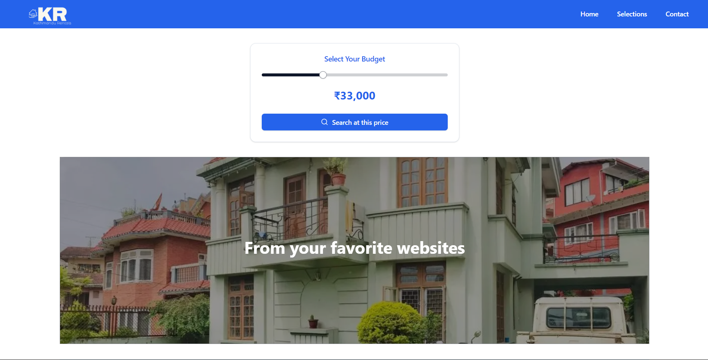
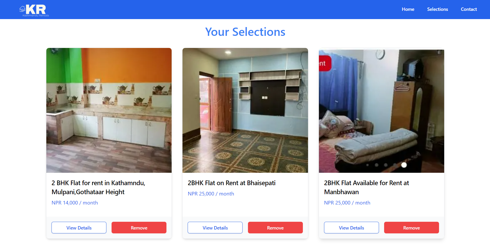

`# Accommodation Finder

**Accommodation Finder** is a web application that aggregates rental listings from various property websites and displays them in one place, allowing users to easily view and track rental listings. Currently, it scrapes data from two websites: **meroproperty.com** and **nepalpropertybazaar.com** using Python's **Beautiful Soup** for web scraping.

## Features
- **Unified Rental Listings:** Displays rental listings from multiple websites in one place.
- **Tracking and Filtering:** Users can filter listings based on price, location, and more, and track websites they are interested in.
- **Data Scraping:** Python scripts are used to scrape rental listings from different websites and populate the database.

## Technologies Used
### Backend
- **Node.js** with **Express**
- **MongoDB** for database management
- **Beautiful Soup** (Python) for scraping data

### Frontend
- **Next.js** for server-side rendering and frontend logic
- **ShadCN UI** for styling and components
- **Tailwind CSS** for styling

## Project Setup

### Clone the Repository

To clone this repository to your local machine, use the following command:

```sh
git clone https://github.com/ShrineSigdel/accommodation-finder.git
```

After cloning, navigate into the project directory:

```sh
cd accommodation-finder
```

### Backend Setup

Navigate to the backend directory:

```sh
cd backend
```

Set up environment variables:

- Create a `.env` file in the backend directory.
- Add the necessary environment variables as specified in the project documentation (such as MongoDB URI, API keys, etc.).

Install dependencies and start the backend server:

```sh
npm install
npm start
```

The backend server will run on `http://localhost:5000`.

### Python Dependencies

To run the Python scraping scripts, you need to install the required packages. Install the dependencies listed in the `requirements.txt` file :


```sh
pip install -r scraping/requirements.txt
```
```

Populate the database using the provided Python script to scrape data from the rental websites:

```sh
npm run script
```

### Frontend Setup

Navigate to the frontend directory:

```sh
cd ../frontend
```

Install dependencies and start the frontend server:

```sh
npm install
npm run dev
```

The frontend server will run on `http://localhost:3000`.

## Screenshots

Below are screenshots of the application showcasing the user interface and functionality.

## Screenshots

Below are screenshots of the application showcasing the user interface and functionality.

### Main Page

*The main page displays a unified list of rental properties aggregated from multiple websites, allowing users to easily browse through available listings.*

### Tracking Favorite Listings

*Users can track their favorite listings, making it easier to revisit and compare properties they are interested in.*


## Web Scraping Information

Websites Scraped:

- meroproperty.com
- nepalpropertybazaar.com

Scraping Tool: Python's Beautiful Soup is used to parse and extract rental listings from these websites.

Data Storage: The scraped data is stored in a MongoDB database for easy retrieval and display.

## Contributing

We welcome contributions! If you have ideas, bug fixes, or new features you would like to add, feel free to submit a pull request.

### Steps to Contribute:

1. Fork the repository.
2. Create a new branch for your feature/fix.
3. Make your changes.
4. Submit a pull request.`